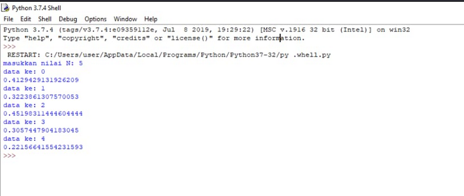
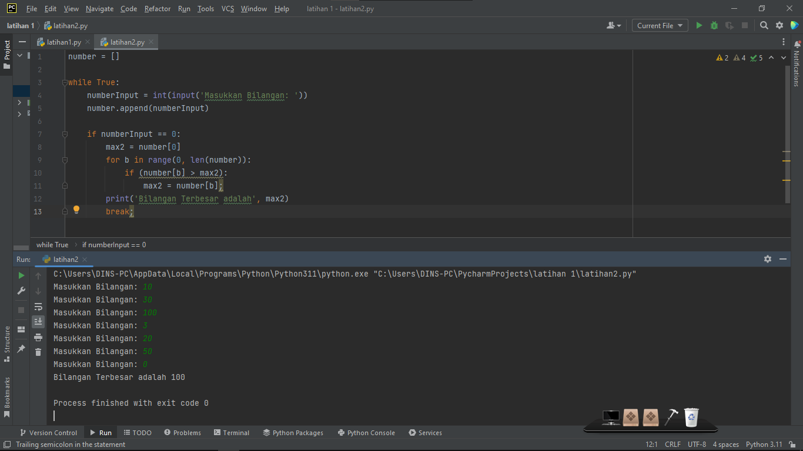
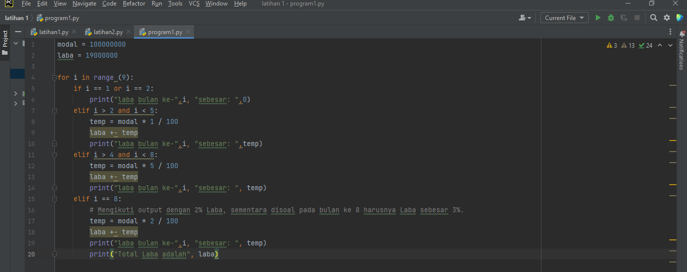
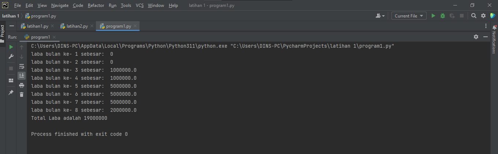

# TUGAS BAHASA PEMOGRAMAN
## TUGAS LATIHAN1.PY, LATIHAN2.PY, & PROGRAM1.PY

Nama : Selma Ohoira

NIM : 312210727

Kelas : TI.22.C9

## Latihan1.py

Tampilkan N bilangan acak kurang dari 0,5.

    Import Random.

import random;

    Masukan nilai N.

N = int(input('Masukkan nilai N: '));

    Looping nilai N menggunakan For.

for i in range(N)

    Random dengan random.uniform dengan range 0.0 - 0.5.

random2 = random.uniform(0.0, 0.5);

    Print hasil random.

print(random2);

# Hasil output latihan1.py

# Latihan2.py
Program untuk menampilkan bilangan terbesar dari N buah data yang diinputkan. Masukkan angka 0 untuk berhenti.

    Buat variabel Array.

number = [];

    Looping menggunakan While dengan kondisi True.

while True

    Input nomor untuk dimasukan ke dalam Array.

numberInput = int(input('Masukkan Bilangan: '));
number.append(numberInput);

    Menggunakan logif If saat input == 0.

if numberInput == 0:

    Membuat Perulangan dengan For untuk menentukan angka terbesar dalam Array.

    max2 = number[0];
    for b in range(0, len(number)):        
        if(number[b] > max2):    
            max2 = number[b];    

    Menampilkan Angka Terbesar.

print('Bilangan Terbesar adalah', max2);

    Menghentikan While dengan Breaks saat input == 0.

if numberInput == 0:
        max2 = number[0];
        for b in range(0, len(number)):        
            if(number[b] > max2):    
                max2 = number[b];    
        print('Bilangan Terbesar adalah', max2);
        break;

# Hasil output latihan2.py

# Program1.py
Program sederhana dengan perulangan. Seorang pengusaha menginvestasikan uangnya untuk memulai usahanya dengan modal awal 100 juta, pada bulan pertama dan kedua belum mendapatkan laba. pada bulan ketiga baru mulai mendapatkan laba sebesar 1% dan pada bulan ke 5, pendapatan meningkat 5%, selanjutnya pada bulan ke 8 mengalami penurunan keuntungan sebesar 2%, sehingga laba menjadi 3%. Hitung total keuntungan selama 8 bulan berjalan usahanya.

    Buat variabel Modal, dan laba.

modal = 100000000;
laba = 0;

    Looping menggunakan For Range dengan kondisi 9x loops.

for i in range (9):

    Menggunakan Pengkondisian ketika perulangan.

if i == 1 or i == 2:
...
elif i > 2 and i < 5:
...
elif i > 4 and i < 8:
...
elif i == 8:
...

    Mencetak besaran laba tiap loop.

print("laba bulan ke-",i, "sebesar: ", 0);

    Membuat perhitungan laba dan menyimpannya pada variabel laba.

temp = modal * 1 / 100;
laba += temp;  

    Menampilkan Total Hasil Laba.

print('Total Laba adalah', laba);

# Hasil Output Program1.py

SELESAI !!